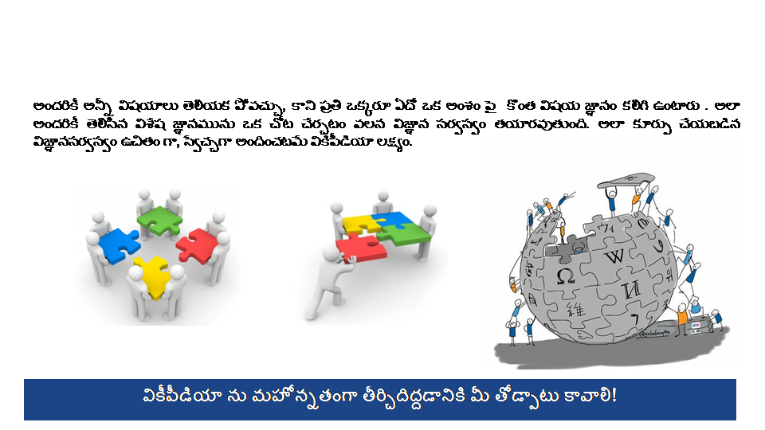
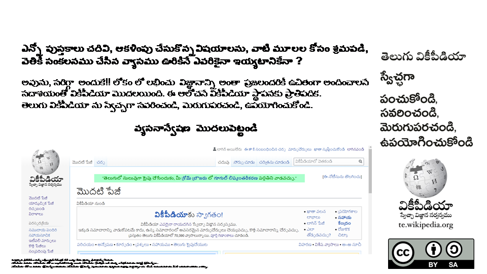

summary: Testing sample1 wiki
id: twiki1
categories: Sample2
tags: medium
status: Published 
authors: taz

# తెలుగు వికీపీడియా పరిచయం 1
<!-- ------------------------ -->

## తెలుగు వికీపీడియాలో వ్యాస రచన పై భోధనాభ్యాసనము
Duration: 1

**అంశము : వికీపీడియా పరిచయం**

**పాఠ్య లక్ష్యం:** వికీపీడియా, ఒక బహుభాషా,  అంతర్జాల (వెబ్) ఆధారిత, ఎవరైనా వ్రాయగలిగిన  స్వేచ్ఛా విజ్ఞాన సర్వస్వము. వికీపీడియా లో రకరకాల అంశాల గురించి చదువుకోవచ్చు. అలాగే మనకి మంచి భాష, విషయ పరిజ్ఞానం వున్నపుడు వ్రాయవచ్చు కూడా. అలా వ్రాయాలనుకొనే ఔత్సాహికులకు వికీపీడియా వెబ్ లే ఔట్ ని పరిచయం చెయ్యటం, కొన్ని విధానాలను, నియమాలపై అవగాహన కలిగించటం ఈ మాడ్యూల్ ఉద్దేశం.

**ఈ పాఠము లో -**

**1. వికీపీడియా పరిచయం** - పాఠ్యము, వికీపీడియా చరిత్ర, 5 మూల స్తంభాలు, వికీపీడియాకు మీరు ఎలా తోడ్పడగలరు - 15 నిమిషములు

**2. వికీపీడియా వెబ్ లే ఔట్ పరిచయం** - వీడియో, తెలుగు వికీపీడియా లో మొదటి పేజీ, అందులో వున్నవివిధ పేజీ లింకులు, వాటిలో నేర్చుకో గల అంశములు   - 7:19 నిమిషములు  
**3. తరచుగా అడిగే ప్రశ్నలు** - 5 నిమిషములు  
**4. అభ్యాసము** - పాఠ్యము చదివి, వీడియో చూసిన తరువాత ఈ అసైన్మెంటుని పూర్తి చెయ్యండి -  10 నిమిషములు.  

**అభ్యాస ఫలితం : వికీపీడియా గురించి అవగాహన పొంది, వెబ్ సైట్ లో వివిధ  పేజీలలో విహరించగలరు.**
<!-- ------------------------ -->

## వికీపీడియా

<!-- ------------------------ -->

## వికీపీడియా లక్ష్యం

<!-- ------------------------ -->

## తెలుగు వికీపీడియా

<!-- ------------------------ -->

## వికీపీడియా ఐదు మూలస్తంభాలు

<!-- ------------------------ -->

## వికీపీడియా విధానాలు

<!-- ------------------------ -->

## వికీపీడియా వ్యాసాల నాణ్యత

<!-- ------------------------ -->

## కాపీరైటు / రచనాస్వామ్యం

<!-- ------------------------ -->

## వికీ వాలంటీర్లు ఏవిధంగా కంట్రిబ్యూట్ చేస్తారు

<!-- ------------------------ -->

## వికీపీడియాకి నేనెలా తోడ్పడవచ్చు

<!-- ------------------------ -->

## నాది మీది అందరిదీ

<!-- ------------------------ -->

## వికీపీడియా పరిచయం

[**వికీపీడియా పరిచయం**](https://www.youtube.com/watch?v=NFqOIL6i-Ag&feature=emb_logo)
<!-- ------------------------ -->

## తరచూ అడిగే ప్రశ్నలు

**1. వికీ అంటే ఏమిటి?**

వికీ అనేది ఒకదానికొకటి అనుబంధమున్న వెబ్‌ పేజీల **సమూహం** . వీటన్నిటినీ ఎవరైనా, ఎప్పుడైనా చూడ వచ్చు, మార్పు చేర్పులు చెయ్యవచ్చు.(Collaborative software). ఇది ఆసక్తికరంగానూ, సరదాగానూ అనిపిస్తోంది. కానీ, దీని వలన సమాచారానికి భద్రత కరవై, తప్పులతో కూడి పనికిరాకుండా పోవచ్చు. వార్డ్‌ కన్నింగ్‌హామ్‌ ఈ భావాన్నీ, సాఫ్ట్‌వేర్‌ ను కనుక్కున్నారు. ఈ పేజీలో పైనున్న "మార్చు" అనే లింకును నొక్కి, ఈ పేజీని సైతం దిద్దుబాటు చెయ్యవచ్చు లెదా కుడి పక్కనున్న "[edit]" అనే లింకును నొక్కి ఏదో ఒక విభాగాన్ని మాత్రమే దిద్దుబాటు చెయ్యవచ్చు! ఈ పేజీలో మార్పులు చేర్పులు చెయ్యటానికి మీకేమీ కనిపించకపోతే, అసలిది ఎలా పనిచేస్తుందో చూడాటానికి ప్రయోగశాల లో ప్రయోగాలు చెయ్యండి.

**2. వికీపీడియా అంటే ఏమిటి?**

వికీపీడియా అనేది ఒక సమగ్రమైన, ఉచితంగా లభించే కొత్త తరహా విజ్ఞాన సర్వస్వాన్ని తయారుచేసే ఒక పథకం. మరింత సమాచారం కొరకు వికీపీడియా:గురించి మరియు వికీపీడియా:వికీపీడియా లను చూడండి

**3. దీన్ని వికీపీడియా అని ఎందుకంటారు?**

వికీపీడియా అనేది "వికి" మరియు "ఎన్‌సైక్లోపీడియా" అనే పదాల కలయిక తో పుట్టిన పదం.

**4. వికీపీడియా లక్ష్యం ఏమిటి?**

విస్తృతి లోనూ, లోతు లోను కూడ అత్యంత పెద్దదైన ఒక ఉచిత, నమ్మదగ్గ విజ్ఞాన సర్వస్వాన్ని— తయారుచెయ్యడమే. ఈ బృహత్తర లక్ష్యాన్ని సాధించటానికి ఎన్నో సంవత్సరాలు పట్టవచ్చు!

**5. వికీపీడియా ఎవరిది?**

వికీపీడియాని మాతృ సంస్థ అయిన వికీమీడియా ఫౌండేషన్‌ నిర్వహిస్తుంది. వికీపీడియా సోదర ప్రాజెచ్టులైన విక్షనరీ (వికి నిఘంటువు), వికీబుక్స్‌ (ఉచిత పాఠ్యపుస్తకాలు), మొదలైన వాటితో పాటు, సంబంధిత డోమైన్‌ పేరులను కూడా కలిగివుంది. ఇదివరలో, ఈ సైటును జిమ్మీ వేల్స్‌ కు చెందిన బొమిస్‌ Inc అనే కంపెనీ సర్వర్లలో వుండేది. ఈ కంపెనీ ప్రస్తుతం సిటు యొక్క ఖర్చుల్లో కొంత భాగాన్ని భరిస్తోంది. వికీమీడియా ఫౌండేషన్‌ ను జూన్‌ 20, 2003 లో ఏర్పాటు చేసిన తరువాత డొమైన్‌ పేర్లూ, సంకేతిక పరికరాలు ఫౌండేషన్‌ కు బదిలీ అయ్యాయి. జిమ్మీ వేల్స్‌ ప్రవచించిన సిధ్ధాంతాల మార్గదర్శకత్వంలో వికీపీడియనుల సముదాయం ప్రస్తుతం ఈ సైటును నిర్వహిస్తున్నది. నిష్పాక్షిక దృక్పథం ఒక ఉదాహరణ.

ఈ సైటులో ప్రచురించిన వ్యాసాలన్నీ ఆయా రచయితలు GNU Free Documentation License కు లోబడి వెలువరిస్తారు, కాబట్టి ఈ వ్యాసాలన్నీ ఉచితం. వీటిని ఆ లైసెన్సుకు లోబడి ఉచితంగా వాడుకోవచ్చు కూడా. వికీపీడియా వ్యాసాలను ఎలా వాడుకోవచ్చో తెలుసుకోవడం కొరకు కాపీ హక్కులు మరియు పాఠకుల ప్రశ్నలు చూడండి.

**6. వికీపీడియాకు సహకరించడానికి లేదా నమోదు చేయడానికి కనీస వయస్సు అవసరం ఉందా?**

ఏ వయస్సు వారైనా వ్యాసాలను సవరించవచ్చు లేదా నమోదు చేయవచ్చు. వికీపీడియా వినియోగదారులు నమోదు చేసుకునేటప్పుడు తమ వయసును వెల్లడించాల్సిన అవసరం కూడా లేదు!

**7. నేను తెలుసుకో వలసిన నియమములు, మార్గదర్శకాలు ఏమైనా ఉన్నావా?**

**వికీ సమాజం లక్ష్యం, కీలక విధానాలు -** వికీపీడియా లో వ్రాయడానికి  ముందు మీరు ప్రతీ విధానాన్నీ చదవవలసిన అవసరం లేదు! అయితే, కింద పేర్కొన్న విధానాలు మాత్రం కనీస అవసరాలు. ఎంత త్వరగా వీటి పై పట్టు సాధిస్తే మీ వికీపీడియా అనుభవం అంత బాగుంటుంది.

* వికీపీడియా ఒక విజ్ఞాన సర్వస్వం. ఇదే దాని లక్ష్యం, అంతకు మించి ఇంకేమీ లేదు.
* విషయం పై సత్యాలను, వాస్తవాలను వెల్లడిస్తూ నిష్పాక్షిక దృష్టి తో వ్యాసాలు రాయాలి. పక్ష పాత ధోరణి కూడదు.
* కాపీ హక్కు లను ఉల్లంఘించ వద్దు. ఇది ఉచిత విజ్ఞాన సర్వస్వాన్ని తయారు చెయ్యాలనే సంకల్పానికే విరుద్ధం. వికీపీడియా GNU ఫ్రీ డాక్యుమెంటేషన్‌ లైసెన్సు నిబంధనల కు లోబడి ఉన్న ఒక స్వేచ్ఛా విజ్ఞాన సర్వస్వం. కాపిహక్కులను అతిక్రమించే వ్యాసాలను సమర్పిస్తే అది చట్ట పరమైన వివాదాలకు దారి తీయ వచ్చు.
* ఇతర సభ్యులను గౌరవించండి. వికీపీడియా సభ్యులు విభిన్న అభిప్రాయములు కలిగిన వారు. ఇతరులను గౌరవించడం అనేది ఈ ప్రాజెక్టు విజయానికి కీలక మైనది.

**8. వికీపీడియా రచనల్లో పాటించవలసిన మూడు ప్రాధమిక నియమములు**

పైన వ్రాసిన విధానాలు వికీ సమాజం లో పాటించవలసిన పద్దతులు. ఇక పోతే వికీ పీడియాలో వ్రాసే విషయ సంగ్రహం మూడు మౌలిక సూత్రాలకు కట్టుబడి ఉండాలి. అంటే ఈ మూడు మౌలిక సూత్రములు సభ్యుల అంగీకారం ద్వారా కూడా మార్చడానికి వీలు లేదు. ఆ మూడు సూత్రములు ఏమంటే

* **తటస్థ దృక్కోణం-** వికీపీడియా వ్యాసాలు పక్షపాతరహితంగా ఉండేందుకు ఇక్కడి సభ్యులంతా కృషిచేస్తారు. నిష్పాక్షికంగా రాయడానికి సాధన అవసరం. ఎందుకంటే ప్రతి పరిశీలనా ఏదో ఒక కోణం నుండే ఉంటుంది. అటువంటప్పుడు ఒకటి కంటే ఎక్కువ భావాలను, వాదాలను పేర్కొనడం వల్ల తటస్థ దృక్కోణం కొంతవరకు సాధించవచ్చును.

* **మౌలిక పరిశోధనలు నిషిద్ధం -** వికీపీడియాలో మౌలిక పరిశోధనా వ్యాసాలకు చోటు లేదు. మీరు రాసేది పరిశోధనా వ్యాసం కాదు అని నిర్ధారించు ఏకైక విధానం - మీరు రాసిన విషయానికి సంబంధించిన విశ్వసనీయ మూలం/వనరు లను ఉదాహరించడము! గతంలో ఏ విశ్వసనీయ వనరులోనూ ప్రచురించబడని వ్యాసాన్ని వికీపీడియాలో మౌలిక పరిశోధనా వ్యాసం అంటారు. ఇంతకు ముందు ప్రచురితం కాని వాదనలు, చర్చలు, భావనలు, డేటా, ఆలోచనలు, ప్రకటనలు, సిద్ధాంతాలు, ఇప్పటి కే ప్రచురితమైన విషయాలపై సాగిన కొత్త విషయాలతో కూడిన పరిశోధనాత్మక విశ్లేషణ ఈ కోవలోకి వస్తాయి.

* **నిర్ధారింపతగినది (విషయం నిర్ధారణ) -** వికీపీడియాలో వ్రాసిన విషయం నిజం కావడంతో సరిపోదు. అది నిజమని ఇతరులు నిర్ధారించుకొనేందుకు తగిన అవకాశాలుండాలి. సాధారణం గా లభించు పత్రిక, పుస్తకం, వెబ్‌సైటు, ప్రభుత్వ బులెటిన్ వంటి ఏదో ఒక సర్వజనీన ఆధారం ఉండాలి.
<!-- ------------------------ -->

## వికీపీడియా ప్రాధమిక అవగాహన అంచనా

[**వికీపీడియా ప్రాధమిక అవగాహన అంచనా**](https://docs.google.com/forms/d/e/1FAIpQLSe8RRTjjP02xFu1jaUspnsvbuCcn5yRhBBqN21UWbXvgfOIqg/viewform)

